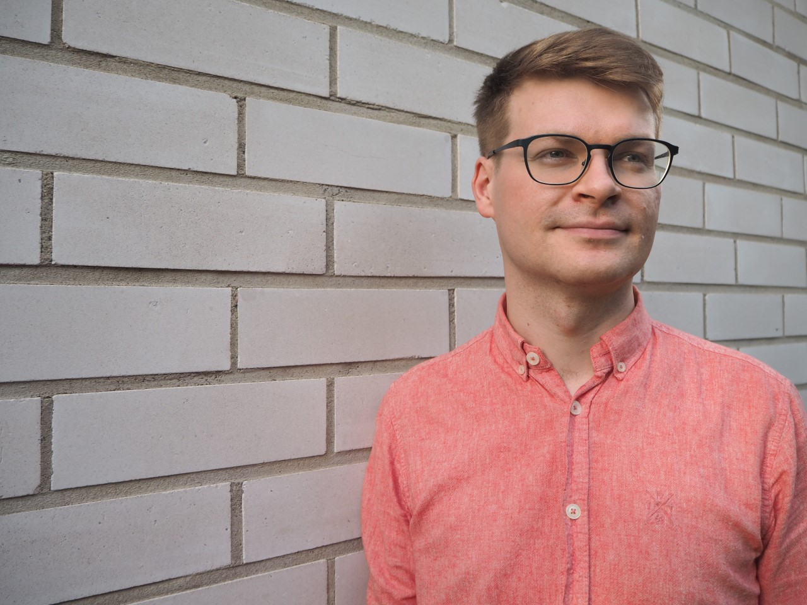

## Kuka?

Työskentelen tällä hetkellä apurahatutkijana suomen kielen oppiaineessa Tampereen yliopistossa. Aloitan akatemiatutkijana syyskuussa 2024.
Olin tutkijatohtorina Helsingin yliopiston [kieliteknologian](https://blogs.helsinki.fi/language-technology/) oppiaineessa.  
Väittelin tohtoriksi Tampereen yliopistosta suomen kielen oppiaineesta kesällä 2021. [Väitöskirja](http://urn.fi/URN:ISBN:978-952-03-1990-8).

## Tutkimuskohteet

* Kielen variaatio ja muutos
* Laskennalliset menetelmät murteiden ja kielenmuutoksen mallintamisessa

## Projektit

* [Puhe puheena](https://research.fi/en/results/funding/81468), Tampereen yliopisto 2024-  
Akatemiatutkijan tehtävä, Suomen Akatemia
* [Arkisuomet](https://research.tuni.fi/arkisuomet/), Tampereen yliopisto 2023-  
PI [Johanna Vaattovaara](https://www.tuni.fi/en/johanna-vaattovaara)
* [CorCoDial](https://researchportal.helsinki.fi/fi/projects/corpus-based-computational-dialectology-exploiting-machine-transl), Helsingin yliopisto 2021-2023  
PI [Yves Scherrer](https://blogs.helsinki.fi/yvesscherrer/)
* [Kippo](https://www.tuni.fi/fi/tutkimus/kielellisten-populaatioiden-muutos-ajassa-kippo-2017-2020), Tampereen yliopisto 2017-2021  
PI [Unni Leino](https://www.tuni.fi/fi/unni-leino)

## Ota yhteyttä virallisesti

* Sähköposti: etunimi.sukunimi[at]tuni.fi
* vierailuosoite: Pinni B, Tampereen yliopisto

## tai epävirallisesti

* [Mastodon](https://mastodontti.fi/@kuparinen)
* [Bluesky](https://bsky.app/profile/kuparinen.bsky.social)

