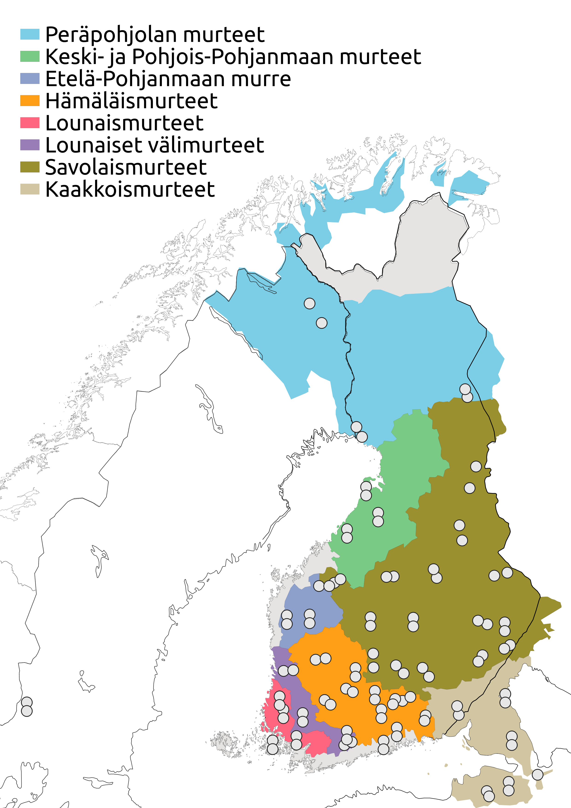

# Murrematkat
Kirjoitan tälle sivulle raportteja pyörämatkoistani Suomen kielen näytteitä -murresarjan puhujien kotipaikoille. Murreaineistoon on haastateltu vanhoja puhujia 50:stä suomenkielisestä pitäjästä 1960- ja 70-luvuilla. Sarjan puhujien asuinpaikat on merkitty oheiseen karttaan yhdessä suomen murrealueiden kanssa.
Aineistosta lisää [Kotimaisten kielten keskuksen sivuilla](https://www.kotus.fi/aineistot/puhutun_kielen_aineistot/murreaanitteita/suomen_kielen_naytteita_-sarja).

## Viimeisimmät

<ul>
  
    <li>
      <h3><a href="{{ post.url }}">{{ post.title }}</a></h3>
      {{ post.excerpt }}
    </li>
  
</ul>
