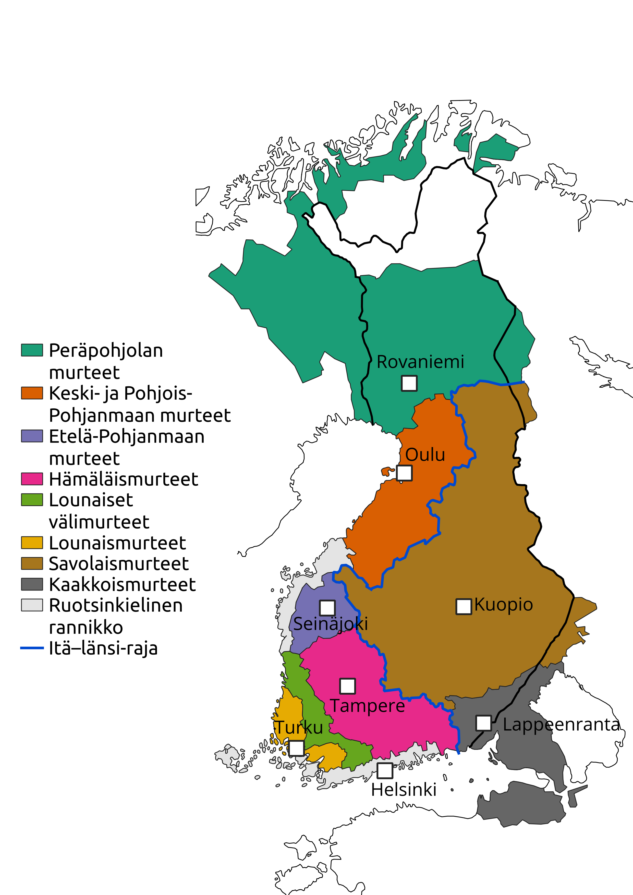

Kaikkien karttojen pohjana on käytetty Kotimaisten kielten keskuksen Suomen murteiden sanakirjan karttapohjaa. Murrealuejako perustuu Lauri Kettusen (1940) kartastoihin ja kuvaa aikaa ennen toista maailmansotaa. Lisenssi: CC-BY 4.0.

## Peräpohjolan murteet

## Keski- ja Pohjoispohjanmaan murteet

## Etelä-Pohjanmaan murre

## Hämäläismurteet

## Lounaismurteet ja lounaiset välimurteet

## Savolaismurteet

## Kaakkoismurteet

