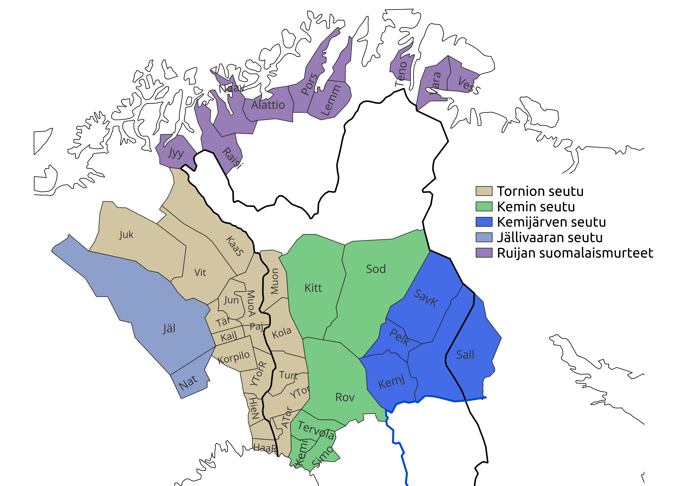
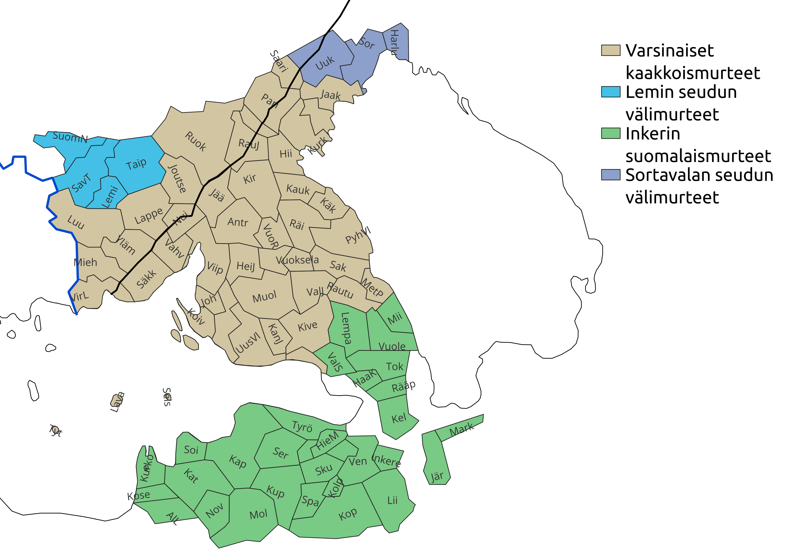

Tämä sivu sisältää karttoja suomen murrealueista sekä murrepiirteiden levikkikarttoja.
* Kaikkien karttojen pohjana on käytetty Kotimaisten kielten keskuksen Suomen murteiden sanakirjan karttapohjaa, ja kartat on tehty vapaasti saatavilla olevalla QGIS-ohjelmistolla.
* Murrealuejako perustuu Terho Itkosen esitykseen (1989). Levikkikartat ovat yksinkertaistettuja versioita Lauri Kettusen (1940) murrekartastosta. 
Kartat saattavat joissain tapauksissa poiketa alkuperäisistä esityksistä, koska pitäjien ja levikkien rajojen tulkitseminen vanhoista kartoista on vaikeaa. 

Kettusen aineisto on ajalta ennen toista maailmansotaa, Itkosen (tiettävästi) sekä ajalta ennen että jälkeen sodan. (Vaikka Itkosen jako on vakiintunut, sen tausta on hyvin epäselvä, ks. Aarikka 2023.)

On korostettava, että murrealueet eivät todellisuudessa ole (tai ole olleet) selvärajaisia ja niiden sijainnista on esitetty runsaasti eroavia näkemyksiä.
Tällä sivulla esitetyt alueet ja rajat ovat suomalaisen murteentutkimuksen alalla kuitenkin melko vakiintuneita.

Lisenssi: CC-BY 4.0. Tekijä Olli Kuparinen.

# Murrealueet

## Peräpohjolan murteet

## Keski- ja Pohjois-Pohjanmaan murteet

## Etelä-Pohjanmaan murre

## Hämäläismurteet

## Lounaismurteet ja lounaiset välimurteet

## Savolaismurteet

## Kaakkoismurteet

# Levikkikartat

## Geminaatioilmiöt
Geminaatiolla tarkoitetaan konsonanttien kahdentumista. Suomen murteissa esiintyy kolmea eri geminaatiotyyppiä, joiden levikki on merkitty karttaan.
* Yleisgeminaatiossa konsonantti kahdentuu lyhyen, painollisen tavun jäljessä ja pitkän vokaaliaineksen edellä (esim. kallaa, tekkee, kottiin).
* Itämurteiden erikoisgeminaatiossa konsonantti kahdentuu aina pitkän vokaaliaineksen edellä (esim. syömmään ruokkaa). Itämurteiden erikoisgeminaatio sisältää siis myös yleisgeminaation.
* Lounaismurteiden erikoisgeminaatiossa k, p, t ja s kahdentuvat soinnillisen äänteen jäljessä ja pitkän (mutta sittemmin lyhentyneen) vokaaliaineksen edellä (esim. kulkke vapautte).

## Diftongien avartuminen
Diftongit ie, uo ja yö avartuvat kartalla kuvatulla alueella (eli ovat ennemminkin ia/iä, ua, yä).

## Vokaaliyhtymät iA, UA
Suomen murteissa vokaaliyhtymät OA ja eA oikenevat laajalti (palloa > palloo, korkea > korkee). Vokaaliyhtymät iA ja UA oikenevat (kahvii, kakkuu) pienemmällä alueella, joka on kuvattu kartassa.

## Persoonapronominit mie ja myö
Yksikön ensimmäisen persoonan pronomini mie ja monikon ensimmäisen persoonan pronomini myö esintyvät osittain yhdessä ja osittain erillään. Näiden pronominien levikki on kuvattu kartassa.

## Diftongiutuminen
Diftongiutumisella tarkoitetaan prosessia, jossa pitkästä vokaalista kehittyy diftongi (esim. siis maa > mua, pää > peä). Diftongiutumisen levikki ja diftongin laatu on kuvattu kartassa.

## Liudennus
Liudennuksella tarkoitetaan konsonanttien ääntämyksen j-mäistä sävyä (esim. vesi ääntyy ennemminkin vesj).

## Loi-monikko
Esim. kukkoja > kukkoloi, kukkoloeta

# Lähteet:

Aarikka, Lotta. (2023). Murre ja sen tutkimus: Näkökulmia fennistisen murteentutkimuksen historiaan ja kieli-ideologioihin 1871–2017. [linkki](https://urn.fi/URN:ISBN:978-951-29-9301-7)

Itkonen, Terho. (1989). Nurmijärven murrekirja. Kotiseudun murrekirjoja 10. Helsinki: Suomalaisen Kirjallisuuden Seura.

Kettunen, Lauri. (1940). Suomen murteet III. A. Murrekartasto. Suomalaisen Kirjallisuuden Seuran toimituksia 188. Helsinki: Suomalaisen kirjallisuuden seura.
