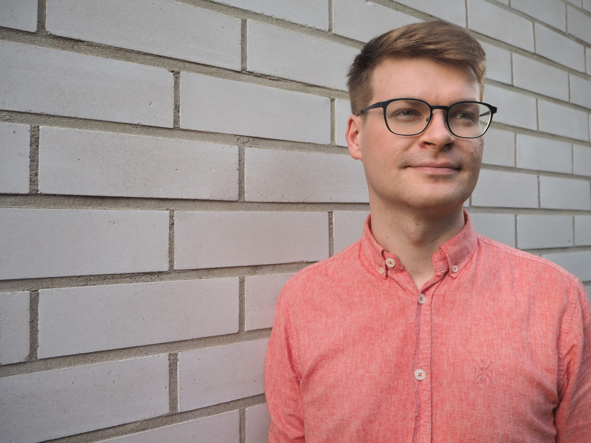

## Introduction

I work currently as a postdoctoral researcher in Finnish language at Tampere University.
I was a postdoctoral researcher in [Language Technology](https://blogs.helsinki.fi/language-technology/) at the University of Helsinki.  
I defended my [PhD thesis](http://urn.fi/URN:ISBN:978-952-03-1990-8) in Finnish language in June 2021.

I visited KU Leuven from 5 Sep to 2 Dec 2022.

## Research interests

* Language variation and change
* Computational methods in modeling dialectal differences

## Projects

* [LANGAWARE](https://research.tuni.fi/arkisuomet/en/), Tampere University 2023-  
PI [Johanna Vaattovaara](https://www.tuni.fi/en/johanna-vaattovaara)
* [CorCoDial project](https://researchportal.helsinki.fi/fi/projects/corpus-based-computational-dialectology-exploiting-machine-transl), University of Helsinki 2021-2023  
PI [Yves Scherrer](https://blogs.helsinki.fi/yvesscherrer/)
* [Kippo project](https://www.tuni.fi/fi/tutkimus/kielellisten-populaatioiden-muutos-ajassa-kippo-2017-2020), Tampere University 2017-2021  
PI [Unni Leino](https://www.tuni.fi/fi/unni-leino)

## Contact

* E-mail: firstname.lastname[at]tuni.fi
* Visiting address: Pinni B, Tampere University

## Find me:

* [Mastodon](https://mastodontti.fi/@kuparinen)
* [Bluesky](https://bsky.app/profile/kuparinen.bsky.social)

